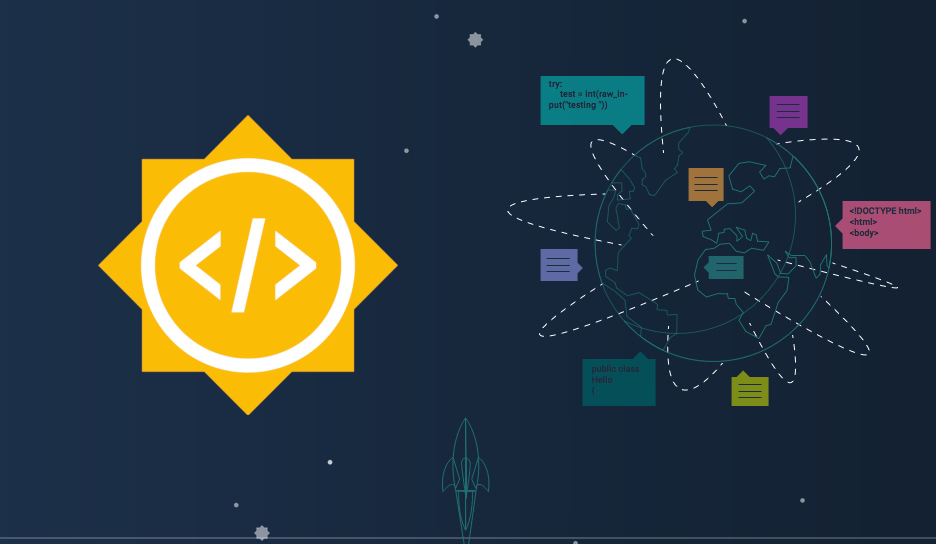

## Google Summer of Code Personal Archives

## Year 2019
* **[Programme Details](#programme)**
  - [Abstract](#abstract)
  - [Final Code Repository](https://github.com/G-Node/gin-proc)
  - [Product Delivered](#delivered)
  - [Features Left](#left)
  - [Work Progress Report](#work-progress)

-----------------------------------------------

## Programme Details

Year - **2019**

Title - **Continuous Integration of Research Data**

Link - **[Google Archives](https://summerofcode.withgoogle.com/projects/#6332724825030656)**

Status - **Finished** :heavy_check_mark:

Final Work - **[G-Node/gin-proc](https://github.com/G-Node/gin-proc)** :heavy_check_mark:

Organisation - **International Neuroinformatics Coordinating Facility, Germany - Node**

Mentors - **Achilleas Koutsou & Michael Sonntag**

Student Moniker - **Mrinal Wahal**

### Abstract

A GIN micro-service which allows the users to design efficient workflows for their work - by automating Snakemake, and build the workflows with a Continuous Integration (CI) service. Given the GIN user base of neuro-scientists and other professionals from the related fields, shouldn’t be involved in writing thousands of repeated workflows for their data, and then testing them manually. This tool increases their efficiency by almost exponential levels by eradicating redundancy from their work.

### What has been delivered?

The micro-service that was proposed in the aforementioned abstract is complete and has been tested to be working as per requirements.

### What is left to be done?

Almost all of the fundamental features required to make the micro-service work are done and completed. However, there are certain issues tagged as **discussion** and/or **advancement** in the [official work repository](https://github.com/G-Node/gin-proc). These issues signify the advanced features that were decided mutually with the mentors and would go on to be open since they'll take a fairly long time (even after the GSoC programme ends) to be discussed, debated and then coded for the original micro-service. Therefore, these issues shall serve the purpose of informing the user's as to what is left to be done, or more aptly - what is about to come to the service in the near future!

### How to track regular work progress?

The [official work repository](https://github.com/G-Node/gin-proc) of the project was initialised fresh for the GSoC programme and no previous codebase for the micro-service existed. Therefore, most of the code in the repository belongs to myself. 

Code was submitted in form of **weekly Pull Requests (PRs)** and therefore, all the closed PRs can be tracked which contain the details of regular work that was done and ultimately planned for those subsequent weeks during the programme. Also, any open PRs can be visited as well.

 

**See you next year, Google! :)**